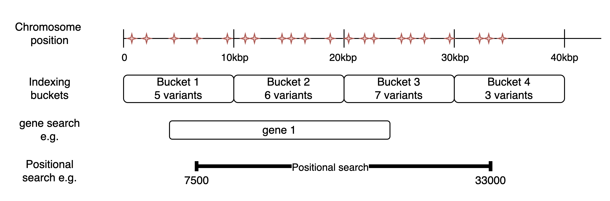

Querying in CanDIG happens on the 'Clinical & Genomic Search' page, which is accessed by clicking the 'Clinical & Genomic Search' button in the header of the CanDIG Data Portal.

## Aggregate vs Donor-level results

Each user that can log into CanDIG may also have specific authorization for programs, either at their home node or at other nodes in the CanDIG network. The authorization status for a user determines what information is displayed to them in the data portal.

When a user performs a search using the filters in the sidebar, for programs they do not have authorization for, they will be displayed aggregated summary results in the Patient Data table and Data Visualization Charts, with any results returned with less than 10 donors censored to `<10`.

For any programs the user has authorization for, they will be displayed the exact number of donors matching the query as well as the full list of donors that match the query. The full metadata for these donors can be explored by clicking the donor row in the 'Matching Patients' table.

## Filtering based on Clinical data 

Currently, users can filter data based on the following fields:
- node location
- program id
- treatment type
- tumour primary site
- systemic therapy drug name
- genomic data type

To perform a search based on these fields, simply select the desired filters then scroll to the top of the sidebar and click 'Search'

:::tip
If multiple values are selected within a filter, they are combined with an OR operator whereas each separate filter is combined with AND

e.g. If a user selects both `Breast` and `Brain` in the primary site filter, it will return donors with either of these primary sites, if the user also selects treatment type as `Systemic therapy`, it will return donors that have a `Systemic therapy` AND a primary site of either `Brain` or `Breast`.
:::

## Variant Search

Donors can be filtered based on the presence of variants within particular regions of the genome. A user can either search for donors with with variants in a particular gene or a particular region by specifying the chromosome, start and end positions. After entering this information, a user just needs to scroll to the top of the sidebar and click 'Search'. The genomic search parameters can be combined with the clinical characteristics discussed above.

### What do the results mean?

To avoid storing every record of every vcf file individually, CanDIG indexes the VCF files. When Variant Call Format (VCF) files are ingested, CanDIG indexes each VCF file by counting the number of variants within 10,000 base pair (10kbp) buckets along each chromosome. CanDIG stores these counts in a quick-search database to provide fast access to search results. When a genomic search is performed, CanDIG calculates which buckets are spanned by the search parameters. Then it queries the database to see which VCF files have records in those buckets. The estimated search returns these approximate counts directly. The following diagram illustrates this with a toy example:

In the example above, if a user searches for ‘gene 1’, the total variant count returned will be 18 (5+6+7), since the gene spans buckets 1-3, but it is possible that some of those variants are within buckets 1 and 3, but not within the span of the gene. If they searched using the coordinates given for the positional search, they would be returned 21 (5+6+7+3) because the search spans buckets 1-4. Again, it is possible that the results include variants that occur in the span 0-7499 and 33001-40000.

If a full search is requested, CanDIG will then use those estimated results to fetch the relevant record chunks from the vcf files and return those, along with Beacon-style variant results. As this query can take some time to complete, it is an asynchronous process and a user needs to check back to get the full results.

To perform a full search, simply call the search endpoint with the query parameter `fullSearch=true` enabled. The result will include a `beaconResultUrl`, which can be refreshed and will return the status of the search while it is in the queue or being performed. After the search is complete, the url will link to the full Beacon search results.

## Downloading data

Users with authorization for specific programs can download clinical data and variant data using the candig download client. See the [candigv2-download-client](https://github.com/CanDIG/candigv2-download-client) for instructions on how to use this tool.
