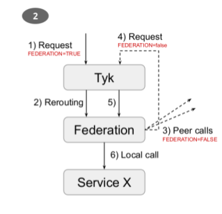

Starting Federation
===================
There are two options for running the Federation service.

.. code-block:: bash

    $ python -m candig_federation

This runs the Flask application directly and offers the ability to change the application configuration through keyword
arguments. With nothing specified, the defaults listed in __main__ of ``candig_federation`` will be used.

.. note::

    The above method is useful for spawning local Federation nodes for simulating more CanDIG sites, but any instance spawned may **not** be used
    as the initial node receiving the request. An instance spawned utilizing uWSGI is required to handle response aggregation. See
    `Request Flow`__ for a better explanation.

.. code-block:: bash

    $ uwsgi federation.ini --http <host>:<port>

This command utilizes uWSGI to run the service as is controlled through the `federation.ini` configuration file. For request aggregation
to function, uWSGI needs to be started with at least two processes.

Incoming Requests
=================

Requests received by Federation are automatically federated throughout the CanDIG network. This federation system is controlled through
a header ``federation`` flag. It is assumed be ``'true'`` unless the header is explicitly added to the request and set to ``'false'``.

Requests should also contain an ``Authorization`` header following the format listed. This token is obtained from the Tyk API Gateway.
While the Federation service itself does not perform authentication checking, this token is required when federating the request out to other CanDIG nodes.

.. code-block:: python

    headers = {
        "accept": "application/json",
        "content-type": "application/json",
        "federation": 'false',
        "Authorization": "Bearer " + token.json()['id_token']
    }

.. __:

Request Flow
============

A request receieved by Federation will follow one of two paths, dependent on the ``federation`` header.

``'false'``: The Federation service will reroute the request to the desired service. Upon receiving a response from the service,
Federation will continue to send it back so that it ends up at the original requester.

``'true'``: The Federation service will federate the request to all of its known peers, **changing the** ``federation`` **flag to** ``'false'``. Upon receiving a response from each of its
peers, the Federation service will aggregate all the responses and return a combined response back to the requester.

.. note::

    The case of ``federation: 'true'`` means that Federation will send a request to **itself**, which is why uWSGI needs to be running the service. Multiple processes
    of the initial Federation service need to be running in order to handle the second incoming request since the first process will be waiting on the initial request.

    This was the request flow decided upon during technical meetings in order to keep the service is uniform as possible with regards to request handling.

