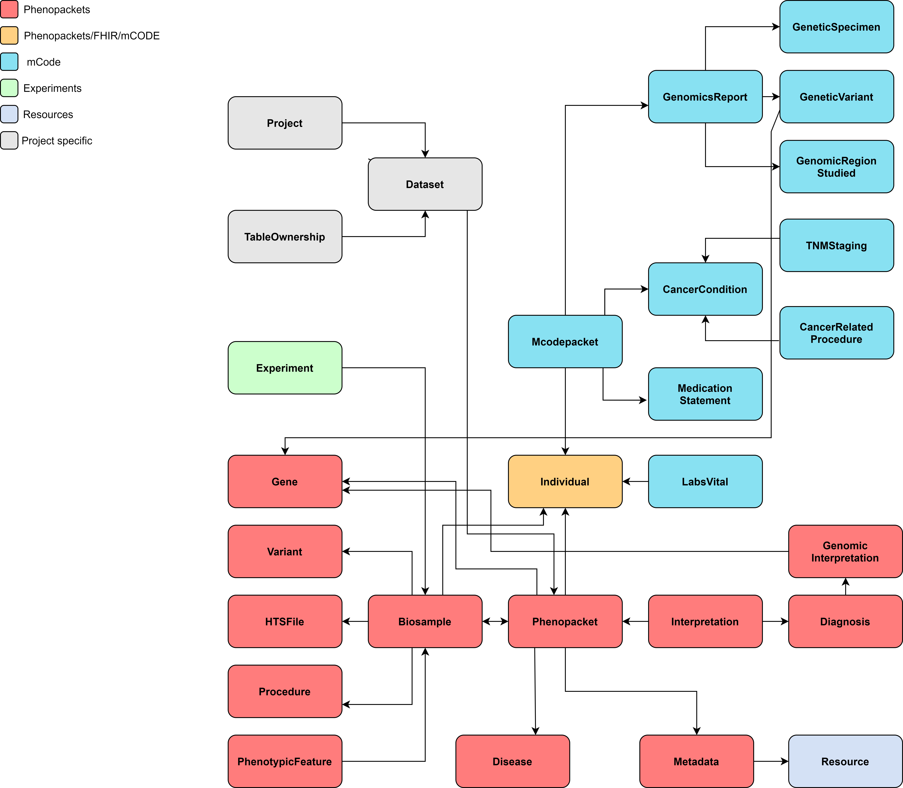

Introduction
============

Katsu Metadata service is a service to store phenotypic and clinical metadata about the patient and/or biosample.
The data model is partly based on `GA4GH Phenopackets schema <https://github.com/phenopackets/phenopacket-schema>`_ and
extended to support oncology-related metadata and experiments metadata.

The simplified data model of the service is below.

Technical implementation
------------------------

The service is implemented in Python and Django and uses PostgreSQL database to store the data.
Besides PostgreSQL, the data can be indexed and queried in Elasticsearch.

Architecture
------------

The Katsu Metadata Service contains several services that share one API.
Services depend on each other and are separated based on their scope.

**1. Patients service** handles anonymized individual’s data (e.g. individual id, sex, age, or date of birth).

- Data model: aggregated profile from GA4GH Phenopackets Individual, FHIR Patient, and mCODE Patient. It contains all fields of Phenopacket Individual and additional fields from FHIR and mCODE Patient.

**2. Phenopackets service** handles phenotypic and clinical data.

- Data model: GA4GH Phenopackets schema. Currently contains only two out of four Phenopackets top elements - Phenopacket and Interpretation.

**3. mCode service** handles patient's oncology-related data.

- Data model: mCODE data elements. mCODE data elements grouped in a mCodepacket (like Phenopacket) containing patient's cancer-related descriptions including genomics data, medication statements, and cancer-related procedures.

**4. Experiments service** handles experiment related data.

- Data model: derived from IHEC metadata `Experiment specification <https://github.com/IHEC/ihec-ecosystems/blob/master/docs/metadata/2.0/Ihec_metadata_specification.md#experiments>`_.

**5. Resources service** handles metadata about ontologies used for data annotation.

- Data model: derived from the Phenopackets schema Resource profile.

**6. CHORD service** handles granular metadata about dataset (e.g. description, where the dataset is located, who are the creators of the dataset, licenses applied to the dataset,
authorization policy, terms of use).
The dataset in the current implementation is one or more phenopackets related to each other through their provenance.

- Data model:

  - DATS model used for dataset description;
  - GA4GH DUO is used to capture the terms of use applied to a dataset.

**7. Restapi service** handles all generic functionality shared among other services (e.g. renderers, common serializers, schemas, validators)

Metadata standards
------------------

`Phenopackets schema <https://github.com/phenopackets/phenopacket-schema>`_ is used for phenotypic description of patient and/or biosample.

`mCODE data elements <https://mcodeinitiative.org/>`_ are used for oncology-related description of patient.

`DATS standard <https://github.com/datatagsuite>`_ is used for dataset description.

`DUO ontology <https://github.com/EBISPOT/DUO>`_ is used for describing terms of use for a dataset.

`Phenopackets on FHIR Implementation Guide <https://aehrc.github.io/fhir-phenopackets-ig/>`_ is used to map Phenopackets elements to `FHIR <https://www.hl7.org/fhir/>`_ resources.

`IHEC Metadata Experiment <https://github.com/IHEC/ihec-ecosystems/blob/master/docs/metadata/2.0/Ihec_metadata_specification.md#experiments>`_ is used for describing an experiment.

REST API highlights
-------------------

**Parsers and Renderers**

- Standard API serves data in snake_case style.

- To retrieve the data in camelCase append :code:`?format=phenopackets`.

- Data can be ingested in both snake_case or camelCase.

- Other available renderers:

  - Currently, the following classes can be retrieved in FHIR format by appending :code:`?format=fhir`: Phenopacket, Individual, Biosample, PhenotypicFeature, HtsFile, Gene, Variant, Disease, Procedure.

  - JSON-LD context to schema.org provided for the Dataset class in order to allow for a Google dataset search for Open Access Data: append :code:`?format=json-ld` when querying dataset endpoint.

  - Dataset description can also be retrieved in RDF format: append :code:`?format=rdf` when querying the dataset endpoint.

**Data ingest**

Ingest workflows are implemented for different types of data within the service.
Ingest endpoint is :code:`/private/ingest`.

**1. Phenopackets data ingest**

The data must follow Phenopackets schema in order to be ingested.
See full :ref:`ingestion-workflow-example`.

Example of Phenopackets POST request body:

.. code-block::

    {
      "table_id": "table_unique_uuid",
      "workflow_id": "phenopackets_json",
      "workflow_params": {
        "phenopackets_json.json_document": "path/to/data.json"
      },
      "workflow_outputs": {
        "json_document": "path/to/data.json"
      }
    }

**2. mCode data ingest**

mCODE data elements are based on FHIR datatypes.
Only mCode related profiles will be ingested.
It's expected that the data is compliant with FHIR Release 4 and provided in FHIR Bundles.

Example of mCode FHIR data POST request body:

.. code-block::

    {
       "table_id":"table_unique_uuid",
       "workflow_id":"mcode_fhir_json",
       "workflow_params":{
          "mcode_fhir_json.json_document":"/path/to/data.json"
       },
       "workflow_outputs":{
          "json_document":"/path/to/data.json"
       }
    }

**3. FHIR data ingest**

At the moment there is no implementation guide from FHIR to Phenopackets.
FHIR data will only be ingested partially where it's possible to establish mapping between FHIR resource and Phenopackets element.
The ingestion works for the following FHIR resources: Patient, Observation, Condition, Specimen.
It's expected that the data is compliant with FHIR Release 4 and provided in FHIR Bundles.

.. code-block::

    {
      "table_id": "table_unique_uuid",
      "workflow_id": "fhir_json",
      "workflow_params": {
        "fhir_json.patients": "/path/to/patients.json",
        "fhir_json.observations": "/path/to/observations.json",
        "fhir_json.conditions": "/path/to/conditions.json",
        "fhir_json.specimens": "/path/to/specimens.json"
      },
      "workflow_outputs": {
        "patients": "/path/to/patients.json",
        "observations": "/path/to/observations.json",
        "conditions": "/path/to/conditions.json",
        "specimens": "/path/to/specimens.json"
      }
    }

Elasticsearch index (optional)
------------------------------

Data in FHIR format can be indexed in Elasticsearch - this is optional.
If an Elasticsearch instance is running on the server (so on :code:`localhost:9000`) these models will be automatically indexed on creation/update.
There are also two scripts provided to update these indexes all at once:

.. code-block::

    python manage.py patients_build_index
    python manage.py phenopackets_build_index

Here is an example request for querying this information:

.. code-block::

    curl -X POST -H 'Content-Type: application/json' -d '{"data_type": "phenopacket", "query": {"query": {"match": {"gender": "FEMALE"}}}}' http://127.0.0.1:8000/private/fhir-search

